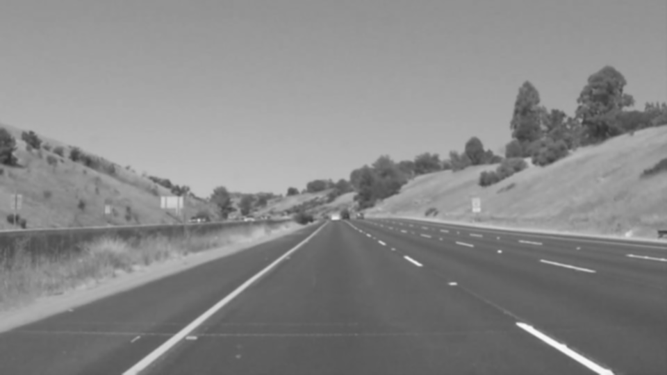
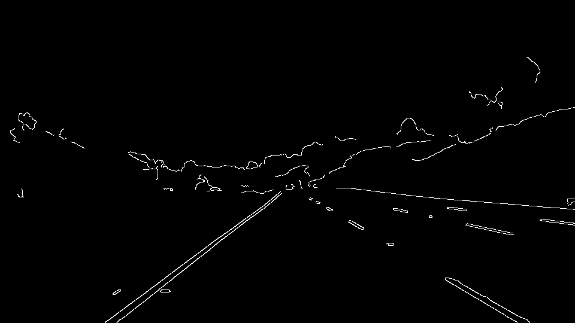
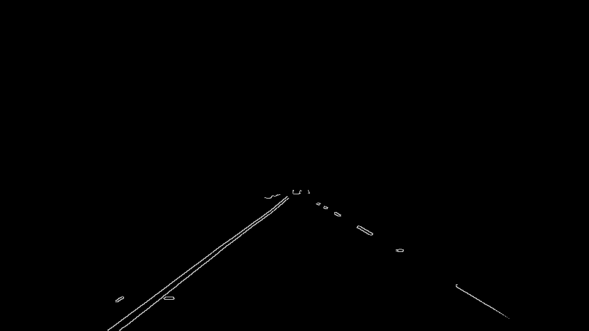
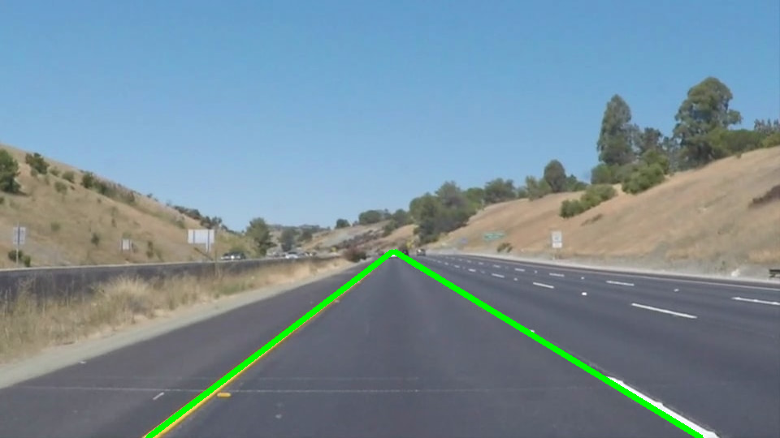

**Finding Lane Lines on the Road**

## Reflection

I was able to put together a simple pipeline which annotates an image of a road
with the lane lines. There are several issues with the Canny edge detection
based approach, and I began to explore some alternative ideas, but I then
realized that we will revisit this topic in the "Advanced lane finding" chapter
of the class, and in the interest of time stuck it out with a simple
approach.

### 1. Pipeline operation

The image pipeline to detect lane lines starts with the standard steps:

 - Conversion to grayscale

 - 5x5 Gaussian blur

 - Canny edge detection

 - Masking a region of interest

From this point, I started out using the probabilistic Hough transform to find
line segments in the image, but when it came time to extrapolate them to find
the actual lane lines, I decided to change my approach.

The natural thing might have been to average or cluster the slope and
intercepts of the lines detected by `HoughLinesP`, perhaps weighted by the
lengths of the lines (or the number of pixels covered by each line). But that
seemed a really roundabout way to achieve a two-line fit.

Instead, I find all the coordinates of the Canny edge pixels on the left and
right halves of the screen, and do an iteratively reweighted least squares fit
procedure on each of them (iteratively reweighted in order to better reject
outliers).

Here, the left edge pixels used in the linear fit are colored yellow and the
right edge pixels are colored cyan. The best-fit lines are in red and blue.

Then I draw the extrapolated line from the bottom of the screen to the vanishing
point y coordinate (which is a parameter of the algorithm).

### 2. Shortcomings of this approach

The initial stages of the pipeline have difficulty finding the all edges of the
yellow lane lines. On the challenge video, the highway divider in shadow shows
up as a strong edge which can throw off the left lane marker estimation.

The challenge video also exhibits a strong edge at the bottom right of the
screen from the car's hood, which must be culled with a suitable region of
interest or the right lane line fit doesn't work at all.

The lane line fitting procedure is not as robust to outliers as I had hoped. It
also makes the false assumption that there is a single line for each lane
marker, when in reality we are fitting the left and right edges of each lane
marker, and there may be other lanes visible in addition.

The fixed region of interest works well on most of the samples and videos, but
is completely wrong for the challenge video; again, the sensitivity to outliers
means the region of interest is very critical for correct results.

As a result, I added some tunable parameters to the image pipeline: the
approximate vanishing point y coordinate in the image, and the bottom y
coordinate of the region of interest (in order to reject car hoods). By
modifying these for the different resolution and geometry of the challenge
video, it does a somewhat decent job until the lighter pavement causes the
edges to be less visible.

### 3. Possible improvements to the pipeline

Instead of stripping the image down to its edges, the image gradient
information might be a lot more useful. The local gradient around each pixel on
a lane marker would give information about which side of the line it's on and
which direction the line goes.

A more robust method might have a more complete model of the image, rather than
just "a line on the left and a line on the right": for example, one could fit a
function of the vanishing point, the lane width, and the line width.

In the video, one could even track the lane parameters with a Kalman or
particle filter.

Finding the region of interest automatically would be a nice feature -- most of
the lines at the bottom of the image should point toward the vanishing point,
and knowing this, we can automatically reject everything not pointing to it as
not a lane marker, and then find all of the lanes in the image.

The iteratively reweighted least squares procedure does a somewhat decent job,
but a fitting procedure like RANSAC might be a lot better against outliers.

Finally, the road could be fit as a circular-ish curve projected onto a plane
below the camera, rather than as a line. Road curvature would be a useful thing
to know for an autonomous car.

